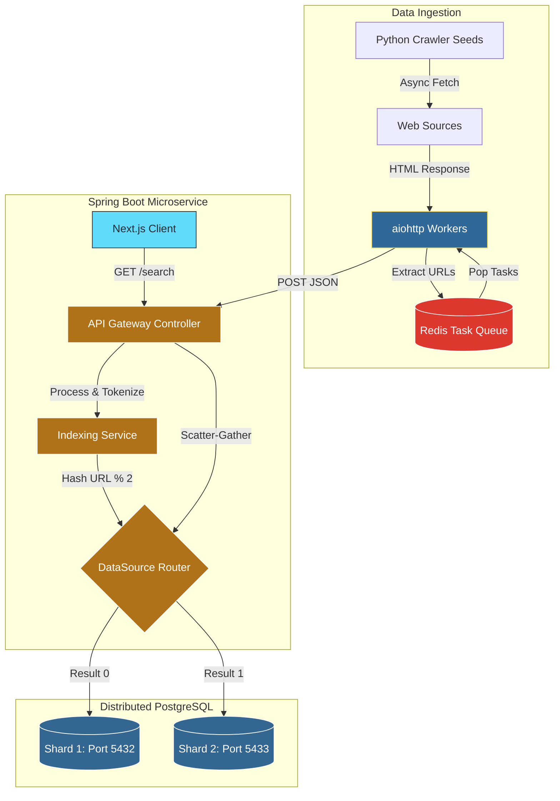

# Distributed Search Engine

A full-stack, distributed search engine simulating core Big Tech infrastructure. This project features an asynchronous web crawler, a mathematically ranked inverted index, and a horizontally sharded database architecture with a scatter-gather query router.

## System Architecture

## Core Engineering Highlights

* **Ingestion Engine (Python):** Engineered an asynchronous web crawler utilizing `aiohttp` and `asyncio`. It is orchestrated by a distributed Redis task queue to prevent duplicate crawling, manage deep pagination, and elegantly handle rate-limiting.
* **API Gateway & Routing (Java/Spring Boot):** Designed a custom scatter-gather search API. During ingestion, it dynamically hashes incoming URLs using an `AbstractRoutingDataSource` and a `ThreadLocal` context to route traffic seamlessly across multiple isolated PostgreSQL database nodes.
* **Algorithmic Ranking:** Implemented a custom TF-IDF (Term Frequency-Inverse Document Frequency) algorithm from scratch. During a query, the engine scatters the request to all shards, calculates mathematical relevance scores, gathers the results, and sorts them to ensure highest-quality matches surface first.
* **Frontend UI (Next.js/React):** Built a minimalist, responsive search interface mimicking a classic search engine. It features real-time asynchronous fetching and dynamically color-codes results to visualize which database shard (`SHARD 1` or `SHARD 2`) the data originated from.

## Testing & Observability

* **Unit Testing (JUnit 5 & Mockito):** The core TF-IDF mathematical ranking algorithm is fully covered by unit tests, mocking database repositories to guarantee floating-point accuracy and correct sorting behavior independent of the database state.
* **Concurrency Testing:** The thread-local database context routing (`DbContextHolder`) is tested under multi-threaded conditions to guarantee isolated database connections during concurrent API requests.
* **Application Metrics:** Integrated **Spring Boot Actuator** to expose production-ready metrics, allowing for real-time monitoring of API throughput, system health, and query latency.

## Tech Stack

* **Frontend:** Next.js, React, Tailwind CSS
* **Backend:** Java 17, Spring Boot, Spring Data JPA, Spring Boot Actuator
* **Ingestion:** Python 3.12, BeautifulSoup4, Redis, `aiohttp`
* **Database:** PostgreSQL (2x Shards via Docker Compose)
* **Testing:** JUnit 5, Mockito, Maven

## Local Setup & Execution

1. **Infrastructure:** Run `docker compose up -d` in the `/infrastructure` directory to spin up the Redis container and both PostgreSQL shards.
2. **Backend API:** Start the Spring Boot application. It will automatically connect to the databases and generate the required schema (`documents` and `inverted_index` tables) on port `8080`.
3. **Crawler:** Navigate to `/crawler`, create a virtual environment, install dependencies (`pip install -r requirements.txt`), and run `python crawler.py` to begin scraping data and populating the distributed databases.
4. **Frontend:** Navigate to `/search-ui`, run `npm install`, then `npm run dev` to launch the interactive UI on port `3000`.

## Performance Metrics

* Successfully executed 100% of backend test suites (3/3 passing), verifying thread-local shard routing and mathematical TF-IDF accuracy via isolated Mockito environments.
* Achieved distributed, fault-tolerant ingestion of over 180 highly-paginated documents across multiple domains.
* Maintained optimized query response times via Spring Boot Actuator monitoring, efficiently executing full scatter-gather database operations.
