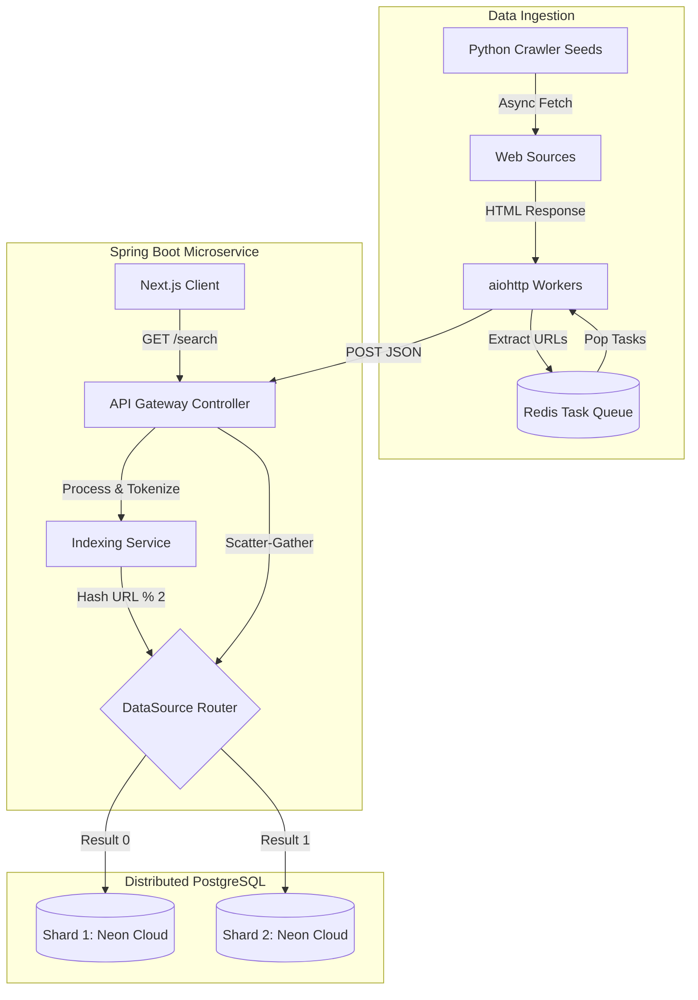

# Distributed Search Engine

**Live Demo:** [distributed-search-engine-beta.vercel.app](https://distributed-search-engine-beta.vercel.app)

A full-stack, distributed search engine simulating core Big Tech infrastructure. This project features an asynchronous web crawler, a mathematically ranked inverted index, and a horizontally sharded database architecture with a scatter-gather query router.

## System Architecture

## Core Engineering Highlights

* **Ingestion Engine (Python):** Engineered an asynchronous web crawler utilizing `aiohttp` and `asyncio`. It is orchestrated by a distributed Redis task queue (Upstash) to prevent duplicate crawling, manage deep pagination, and handle rate-limiting.
* **API Gateway & Routing (Java/Spring Boot):** Designed a custom scatter-gather search API. The engine dynamically hashes incoming URLs using a custom `AbstractRoutingDataSource` and `ThreadLocal` context, routing traffic seamlessly across multiple isolated, serverless PostgreSQL database shards (Neon).
* **Algorithmic Ranking:** Implemented a custom TF-IDF (Term Frequency-Inverse Document Frequency) algorithm from scratch.
* **Frontend UI (Next.js/React):** Built a responsive, minimalist search interface.

## Testing & Observability

* **Unit Testing (JUnit 5 & Mockito):** Full coverage of TF-IDF ranking logic.
* **Concurrency Testing:** Thread-local database context routing tested under multi-threaded conditions.
* **Application Metrics:** Spring Boot Actuator metrics for monitoring.

## Tech Stack

* Frontend: Next.js, React, Tailwind CSS
* Backend: Java 17, Spring Boot, Spring Data JPA
* Ingestion: Python 3.12, BeautifulSoup4, Redis, aiohttp
* Cloud: Render, Vercel, Neon, Upstash
* Testing: JUnit 5, Mockito, Maven

## Performance Metrics

* 100% backend test suite pass rate (3/3).
* Distributed ingestion of 180+ documents.
* Optimized scatter-gather query execution.

## Local Setup & Execution

1. Configure Redis/Postgres.
2. Run backend with `./mvnw spring-boot:run`.
3. Run crawler with `python crawler.py`.
4. Run frontend with `npm run dev`.
