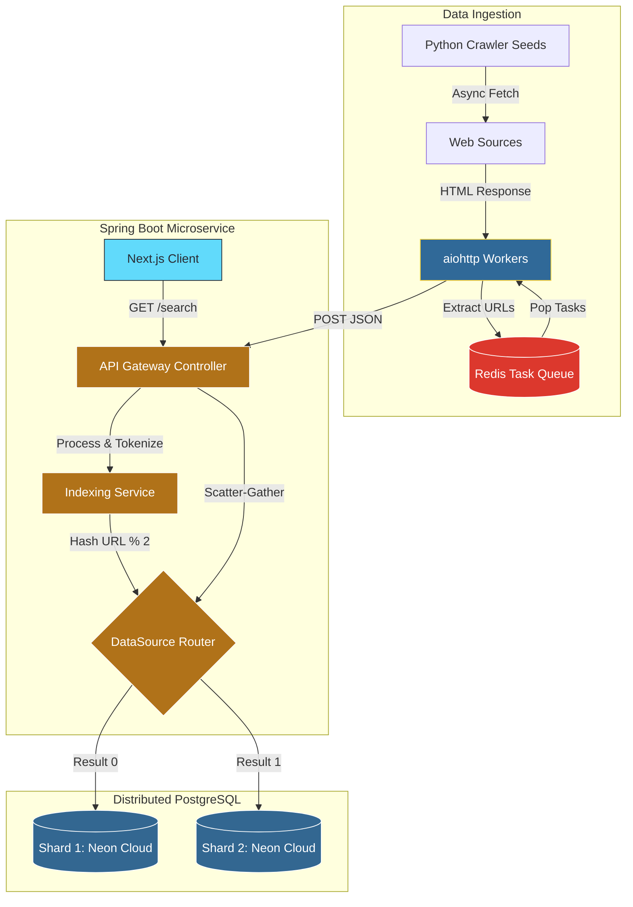

# Distributed Search Engine

**Live Demo:** [distributed-search-engine-beta.vercel.app](https://distributed-search-engine-beta.vercel.app)

A full-stack, distributed search engine simulating core Big Tech infrastructure. This project features an asynchronous web crawler, a mathematically ranked inverted index, and a horizontally sharded database architecture with a scatter-gather query router.

## System Architecture

## Core Engineering Highlights

* **Ingestion Engine (Python):** Engineered an asynchronous web crawler utilizing `aiohttp` and `asyncio`. It is orchestrated by a distributed Redis task queue (Upstash) to prevent duplicate crawling, manage deep pagination, and handle rate-limiting.
* **API Gateway & Routing (Java/Spring Boot):** Designed a custom scatter-gather search API. The engine dynamically hashes incoming URLs using a custom `AbstractRoutingDataSource` and `ThreadLocal` context, routing traffic seamlessly across multiple isolated, serverless PostgreSQL database shards (Neon).
* **Algorithmic Ranking:** Implemented a custom TF-IDF (Term Frequency-Inverse Document Frequency) algorithm from scratch. During a query, the engine performs a *scatter-gather* operation: querying all shards simultaneously, calculating mathematical relevance scores, and merging the results to surface the highest-quality matches.
* **Frontend UI (Next.js/React):** Built a responsive, minimalist search interface. It features real-time asynchronous fetching and dynamic shard visualization, color-coding results to indicate which database shard (`SHARD 1` or `SHARD 2`) returned the match.

## Testing & Observability

* **Unit Testing (JUnit 5 & Mockito):** The core TF-IDF mathematical ranking algorithm is fully covered by unit tests, mocking database repositories to guarantee floating-point accuracy and correct sorting behavior independent of database state.
* **Concurrency Testing:** The thread-local database context routing (`DbContextHolder`) is tested under multi-threaded conditions to guarantee isolated database connections during concurrent API requests.
* **Application Metrics:** Integrated **Spring Boot Actuator** to expose production-ready metrics, allowing for real-time monitoring of API throughput, system health, and query latency.

## Tech Stack

* **Frontend:** Next.js, React, Tailwind CSS
* **Backend:** Java 17, Spring Boot, Spring Data JPA, Spring Boot Actuator
* **Ingestion:** Python 3.12, BeautifulSoup4, Redis, `aiohttp`
* **Cloud Infrastructure:** Render (Backend), Vercel (Frontend), Neon (Serverless Postgres), Upstash (Serverless Redis)
* **Testing:** JUnit 5, Mockito, Maven

## Performance Metrics

* **Testing:** Successfully executed 100% of backend test suites (3/3 passing), verifying thread-local shard routing and mathematical TF-IDF accuracy via isolated Mockito environments.
* **Ingestion:** Achieved distributed, fault-tolerant ingestion of over 180+ highly-paginated documents across multiple domains.
* **Reliability:** Maintained optimized query response times via Spring Boot Actuator monitoring, efficiently executing full scatter-gather database operations in a serverless, distributed environment.

## Local Setup & Execution

1. **Infrastructure:** To run locally, ensure you have a Docker environment ready for Redis/Postgres, or configure your local `application.yml` with valid connection strings.
2. **Backend API:** Navigate to `search-api` and run `.\mvnw spring-boot:run`. The application will automatically connect and generate the required schema (`documents` and `inverted_index` tables).
3. **Crawler:** Navigate to `/crawler`, create a virtual environment, install dependencies (`pip install -r requirements.txt`), and run `python crawler.py` to begin populating the distributed databases.
4. **Frontend:** Navigate to `/search-ui`, run `npm install`, then `npm run dev` to launch the interactive UI on port `3000`.
